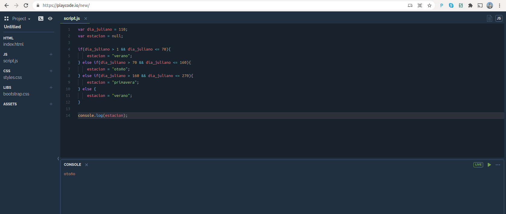

# Módulo 0: Tutorial de Introducción a Javascript.

## Lenguaje Javascript.

JavaScript (abreviado como JS) es un lenguaje ligero, interpretado y orientado a objetos con funciones first-class, y es mejor conocido como el lenguaje de scripting para páginas web, pero también se usa en muchos entornos que no son de navegador (¡GEE!). Es un lenguaje de scripting de múltiples paradigmas basado en prototipos que es dinámico y admite estilos de programación orientados a objetos, imperativos y funcionales.

## Consola JS para este tutorial

Las pruebas que vamos a realizar serán corridas en la consola [Playcode.io](https://playcode.io/new/).




## Tipos de Datos

 - Números
 - Cadenas de texto (Strings)
 - Booleanos
 - Símbolos (nuevo en ES2015)
 - Objetos
    - Funciones
    - Array
 

### Números

```Javascript
var temperatura = 35; // Asignación

console.log(temperatura) // imprime en la consola

```

El objeto [console.log](https://developer.mozilla.org/es/docs/Web/API/Console/log) muestra un mensaje en la consola web (o del intérprete JavaScript).

Operadores numéricos: __+, -, /, *__, etc.

```Javascript
var temperatura_inicial = 35;
var temperatura_final = 28;

var media = (temperatura_inicial + temperatura_final)/2
console.log(media)
```

### Cadenas de caracteres

```Javascript
var saludo = "¡Hola Mundo!";

console.log(saludo)

```

Hay diferentes [métodos](https://developer.mozilla.org/es/docs/Web/JavaScript/Reference/Global_Objects/String#m%c3%a9todos) para manejar objetos de tipo strings.

```Javascript
// Longitud de una cadena de caracteres
var longitud_saludo = saludo.length;

console.log(longitud_saludo)

// Otras funciones del objeto String

console.log( saludo.charAt(1) ) // Acceder a una posición de la cadena

console.log( saludo.replace("Mundo", "INTA") ) // Reemplaza en la cadena saludo la palabra Mundo por INTA

// Concatenar strings
var nombre = "B2" + "_" + "Verano"

```

### Datos booleanos y operadores

JavaScript tiene un tipo [booleano](https://developer.mozilla.org/es/docs/Web/JavaScript/A_re-introduction_to_JavaScript#otros_tipos), con valores posibles true y false (ambos son palabras clave). Cualquier valor se puede convertir a booleano de acuerdo con las siguientes reglas:

 1. false, 0, cadenas vacías (""), NaN, null, y undefined todos se vuelven false.
 2. Todos los demás valores se vuelven true.

Operaciones booleanas como && (and lógico), || (or lógico) y ! (not lógico) son compatibles; ve más adelante.


```Javascript
var es_mayor_a_10 = "¡Hola Mundo!".length > 10;
console.log(es_mayor_a_10);

```

### Estructuras de control

Las declaraciones condicionales son compatibles con __if__ y __else__; las puedes encadenarlas si lo deseas:


```Javascript
// Ejemplo 1: Es una validación del día juliano simple, si el valos de dia_juliano esta dentro del rango esperado tenemos un mensaje de avance y de lo contrario un error

var dia_juliano = 30;

if(dia_juliano >= 1 && dia_juliano <= 365){
    var msg = "Ha transcurrido un ";
    var avance = dia_juliano/365 * 100;
    console.log(msg + avance.toFixed(2) + "% del año.");    
}else{
    console.log("Error: Valor fuera de rango");
}

```


```Javascript
// Ejemplo 2

var dia_juliano = 30;
var estacion = null;

if(dia_juliano > 1 && dia_juliano <= 70){
    estacion = "verano";
} else if(dia_juliano > 70 && dia_juliano <= 160){
    estacion = "otoño";
} else if(dia_juliano > 160 && dia_juliano <= 270){
    estacion = "primavera";
} else {
    estacion = "verano";
}

console.log(estacion);

```

El bucle __for__ te permite proporcione la información de control para tu bucle en una sola línea.

```Javascript
for (var i = 1; i < 5; i++) {
    var banda = "B" + i
    console.log(banda);
}

```

### Objetos

Los [objetos](https://developer.mozilla.org/es/docs/Web/JavaScript/A_re-introduction_to_JavaScript#objetos) de JavaScript se pueden considerar como simples colecciones de pares __nombre-valor__.

Este tipo de estructuras también se la llama Diccionario en otros lenguajes (Python) y en Google Eart Engine.


```Javascript
var obj = {}; // Definición del objeto

// Definir atributos
obj["fecha_inicio"] = "2020-01-01"; 
obj["fecha_fin"] = "2020-03-31"; 

console.log(obj); // Imprimir todo el objeto

// Acceder a los atributos de manera encadenada.
console.log(obj.fecha_inicio); 
```

La sintaxis de objeto literal se puede utilizar para iniciar un objeto en su totalidad:

```Javascript
// En este casos la variable se llama config
var config = {
    "fecha_inicio": "2020-01-01", 
    "fecha_fin": "2020-03-31", 

    "sensor": "Landsat8",
    "cloud_cover": 10

};

console.log(config);

// Acceder a los atributos de manera encadenada.
console.log(config.sensor); 
console.log(config["cloud_cover"]);

```

### Funciones

```Javascript
var semi_suma = function(a, b){
    return (a + b)/2
}
console.log( semi_suma(12.5, 45.2) )

```


### Arreglos
Los arreglos en JavaScript en son realidad un tipo especial de objeto. Funcionan de manera muy parecida a los objetos normales (las propiedades numéricas se pueden acceder naturalmente solo usando la sintaxis []) pero tienen una propiedad mágica llamada 'length'. Este siempre es uno más que el índice más alto de el arreglo.


```Javascript
var años = [2001, 2002, 2003];
console.log( años )

```

```Javascript
for(var i = 0; i< años.length; i++){
  console.log("Año: " + años[i])
}
```


# Referencias

* [Una reintroducción a JavaScript (Tutorial de JS)](https://developer.mozilla.org/es/docs/Web/JavaScript/A_re-introduction_to_JavaScript)


