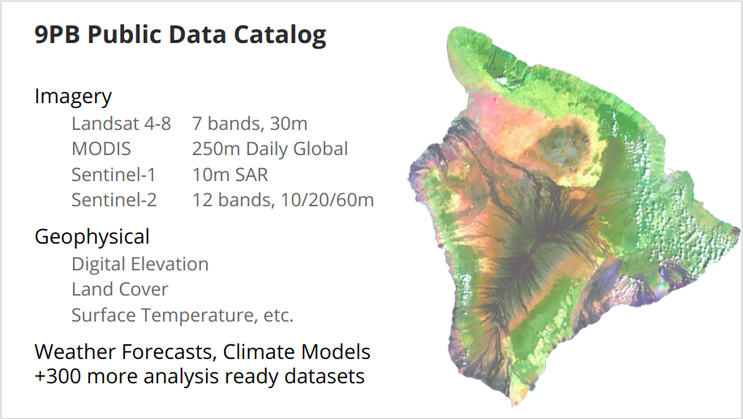
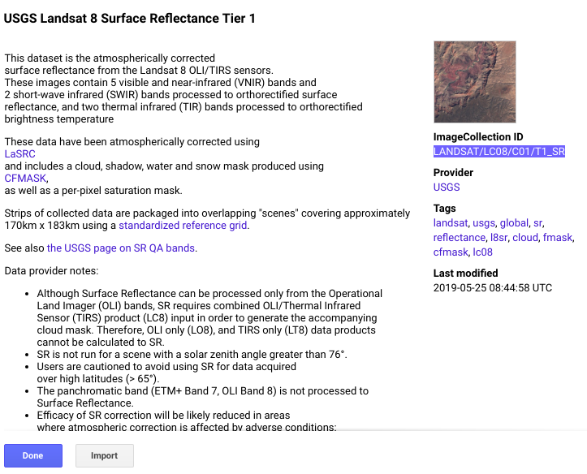
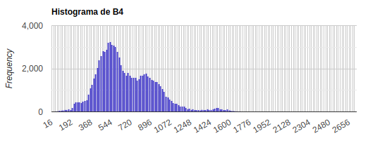
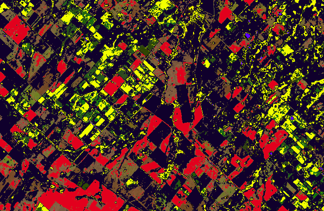
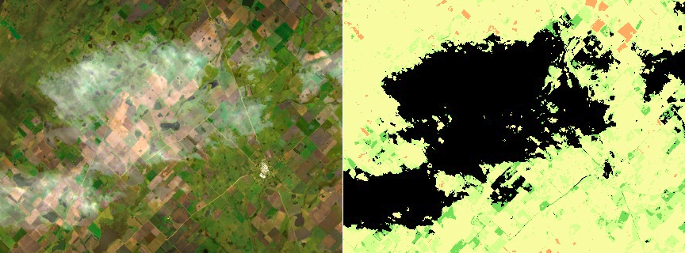

# Módulo 1: Conceptos básicos de EE.

## Descripción de la herramienta Code Editor.

[Code Editor](https://code.earthengine.google.com) (CE) es uno de los clientes para comunicarnos con la API de Google Earth Engine.


 - __Buscador__: Herramienta de búsqueda de datos disponibles en la plataforma. Además, podemos buscar lugares y posicionar el mapa a partir de un topónimo.
 - __Panel Izquierdo__
    - __Scripts__: Espacio de almacenamiento de nuestro código fuente.
    - __Docs__: Documentación sobre la API de ee.
    - __Assets__: Espacio de almacenamiento de nuestros datos, de __*manera gratuita*__ disponemos de __¡¡250GB!!__
 - __Editor de código fuente:__ 

## Los datos disponibles




<svg width="15" height="15" viewBox="5 5 35 35" class="q"><path d="M5 40V5h35v35H5zm8.56-12.63c0 .56-.03.69-.32 1.03L10.8 31.4v.4h6.97v-.4L15.3 28.4c-.29-.34-.34-.5-.34-1.03v-8.95l6.13 13.36h.71l5.26-13.36v10.64c0 .3 0 .35-.19.53l-1.85 1.8v.4h9.2v-.4l-1.83-1.8c-.18-.18-.2-.24-.2-.53V15.94c0-.3.02-.35.2-.53l1.82-1.8v-.4h-6.47l-4.62 11.55-5.2-11.54h-6.8v.4l2.15 2.63c.24.3.29.37.29.77v10.35z"></path></svg> [Lectura Recomendada](https://medium.com/google-earth/our-latest-additions-to-the-earth-engine-data-catalog-ded9c563f676)


## ¿Cómo utilizar GEE?

 - Javascript API
    - Interactive Code Editor
    - Node.js*

 - Python API
	- Python module
	- Web Apps with Appengine
	- Jupyter Notebooks*

Ambos son clientes que se conectan a la API de GEE.

## ¿Cómo se corre un scripts en CE?


```Javascript
// Ejemplo 1
var start_date = "2018-12-01";
var end_date   = "2019-03-31";
var Landsat8SRT1 = ee.ImageCollection("LANDSAT/LC08/C01/T1_SR")
                     .filterBounds(limite)
                     .filterDate(start_date, end_date);
                     
print("# Escenas", Landsat8SRT1.size())
```

## Repositorio del curso en GEE
  https://code.earthengine.google.com/?accept_repo=users/santiagobanchero/curso-gee

## Estructuras de datos para gestión de datos espaciales

### ee.Image

```Javascript
// Ejemplo 2

var escena = ee.Image('LANDSAT/LC08/C01/T1_SR/LC08_225086_20181230');
// Objeto Image
print(escena)
// Lista con los nombres de las bandas
print(escena.bandNames())
// Objeto Image de un subconjunto de bandas que son renombradas
print(escena.select(["B2", "B3", "B4"],["blue","green","red"]))
```

### ee.Geometry

```Javascript
var un_poligono = ee.Geometry.Polygon(
        [[[-60.024, -36.816],
          [-60.024, -36.888],
          [-59.927, -36.888],
          [-59.927, -36.816]]], null, false);
          
print("Un Polígono:", un_poligono);
print("Área m2:", un_poligono.area(1));
print("Área km2:", un_poligono.area(1).multiply(0.0001).ceil());
```

### ee.Feature

```Javascript
var propiedades = {"Nombre": "Lote 1", "Descripcion": "Cultivos de Invierno"}
var un_feature = ee.Feature(un_poligono, propiedades)
print("Un Feature:", un_feature)
print("Área km2:", un_feature.area(1).multiply(0.0001))
print("Un Feature:", ee.String(un_feature.get("Nombre")))
```

## Trabajar con colecciones




### ee.ImageCollection

```Javascript
// Ejemplo 3
var ic_landsat8_SR = ee.ImageCollection("LANDSAT/LC08/C01/T1_SR");
var periodo_1 = {
  start_date: "2017-03-01",
  end_date:   "2017-06-30",
}
var ic_otoño = ic_landsat8_SR
                  .filterBounds(limite)
                  //.filterDate(periodo_1.start_date, periodo_1.end_date)
                  //.filterMetadata("CLOUD_COVER", "less_than", 10)
                  //.filterMetadata("WRS_PATH", "equals", 225)
                  //.filterMetadata("WRS_ROW", "equals", 86)
                  //.select(["B2","B3","B4","B5","B6"]);
print(ic_otoño);
print(ic_otoño.mosaic())
```

### ee.FeatureCollection

```Javascript
var fc_deptos = ee.FeatureCollection("users/santiagobanchero/curso-gee/departamentos");
print("# Deptos:", fc_deptos.size())
print("Un Feature:", fc_deptos.first())

var partido_azul = fc_deptos.filterMetadata("NAM", "equals", "Azul");
print("Feature Azul:", partido_azul);
print("Superficie Azul:", ee.Feature(partido_azul.first()).area().multiply(0.0001));

```
## Agregar layers al mapa

## Configurar la visualización de rasters

```Javascript
// Ejemplo 4
var vis_RGB = {
    bands: ["B4","B3","B2"], 
    min: 66, 
    max: 1600}

var vis_FalsoColor = {
    bands: ["B5","B4","B3"], 
    min: 150, 
    max: 5300, 
    gamma: 1.4}
    
var vis_Paleta = {
    bands: ["B4"], 
    min: 50, 
    max: 1400, 
    palette:['#d73027','#fc8d59','#fee08b','#ffffbf','#d9ef8b','#91cf60','#1a9850']}

Map.addLayer(mosaico, vis_RGB, "RGB", false);
Map.addLayer(mosaico, vis_FalsoColor, "Falso Color", false);
Map.addLayer(mosaico, vis_Paleta, "Paleta", false);
Map.setOptions("HYBRID");
```

## Configurar la visualización de vectores

```Javascript
var fc_deptos = ee.FeatureCollection("users/santiagobanchero/curso-gee/departamentos");
var partido_azul = fc_deptos.filterMetadata("NAM", "equals", "Azul");
Map.addLayer(fc_deptos, {color: "330088"}, "Departamentos")
Map.addLayer(partido_azul, {color: "AA0088"}, "Partido de Azul")
Map.addLayer(fc_deptos, {}, "Deptos")
Map.centerObject(partido_azul)
```

## Operadores de ee.Image

### Operaciones sobre ee.Image

Vamos a empezar realizando un histograma de B4, la idea es que podamos identificar las colas del histograma con alguna cobertura.

```Javascript
// Ejemplo 5
var histogram = ui.Chart.image.histogram({
  image: mosaico.select(["B4"]),
  region: limite,
  scale: 30
});

histogram.setOptions({
  title: 'Histograma de B4'
});

print(histogram);
```


```Javascript
// Ejemplo 5
var B4_bin_inicio = mosaico.lte(192);
var B4_bin_final  = mosaico.gte(1200);

var mask_B4_bin_inicio = B4_bin_inicio.mask(B4_bin_inicio)
var mask_B4_bin_final = B4_bin_final.mask(B4_bin_final)


var vis_RGB = {bands: ["B4","B3","B2"], min: 66, max: 1600}

var vis_Bin_inicio = {bands: ["B4"], min: 0, max: 1, palette: ['#ffff00']}
var vis_Bin_final = {bands: ["B4"], min: 0, max: 1, palette: ['#d73027']}

Map.addLayer(mosaico, vis_RGB, "RGB", false);
Map.addLayer(mask_B4_bin_final, vis_Bin_final, "Bin Final", false);
Map.addLayer(mask_B4_bin_inicio, vis_Bin_inicio, "Bin Inicio", false);

Map.setOptions("HYBRID");
```

## Creación de máscaras.

```Javascript
// Ejemplo 6
// Generamos una nueva imagen del bin 1 del histograma
var B4_bin_inicio = mosaico.lte(320).and(mosaico.gte(200));
var B4_bin_final  = mosaico.gte(900);
var B4_bin_centro  = mosaico.gte(400).and(mosaico.lte(700));
var B4_bin_agua  = mosaico.lte(70);

var mask_B4_bin_inicio = B4_bin_inicio.mask(B4_bin_inicio)
var mask_B4_bin_final = B4_bin_final.mask(B4_bin_final)
var mask_B4_bin_centro = B4_bin_centro.mask(B4_bin_centro)
var mask_B4_bin_agua = B4_bin_agua.mask(B4_bin_agua)

var vis_RGB = {bands: ["B4","B3","B2"], min: 66, max: 1600}

var vis_Bin_inicio = {bands: ["B4"], min: 0, max: 1, palette: ['#ffff00']};
var vis_Bin_final = {bands: ["B4"], min: 0, max: 1, palette: ['#d73027']};
var vis_Bin_centro = {bands: ["B4"], min: 0, max: 1, palette: ['#000027']};
var vis_Bin_agua = {bands: ["B4"], min: 0, max: 1, palette: ['#0000FF']};

Map.addLayer(mosaico, vis_RGB, "RGB", false);
Map.addLayer(mask_B4_bin_final, vis_Bin_final, "Bin Final", false);
Map.addLayer(mask_B4_bin_inicio, vis_Bin_inicio, "Bin Inicio", false);
Map.addLayer(mask_B4_bin_centro, vis_Bin_centro, "Bin centro", false);
Map.addLayer(mask_B4_bin_agua, vis_Bin_agua, "Bin agua", false);
Map.setOptions("HYBRID");
```



## Operador _where_

Con __where__ podemos realizar reemplazos de valores de pixeles.

```Javascript
var bin_1  = mosaico_band.lte(90);
var bin_2  = mosaico_band.gt(90).and(mosaico_band.lte(320)).multiply(2);
var bin_3  = mosaico_band.gt(320).and(mosaico_band.lte(720)).multiply(3);
var bin_4  = mosaico_band.gt(720).and(mosaico_band.lte(900)).multiply(4);
var bin_5  = mosaico_band.gt(900).multiply(5);

var mosaico_discreto = bin_1
                          .add(bin_2)
                          .add(bin_3)
                          .add(bin_4)
                          .add(bin_5);

var banda_azul = mosaico.select("B2");
var nubes = banda_azul.gte(560);

mosaico_discreto = mosaico_discreto.where(nubes, 0);

```



## _map_: ¿qué hacer en lugar de un bucle for?

* ¿Por qué no utilizar bucles en GEE?
* ¿Qué hace _map_? [Vamos a un ppt](https://docs.google.com/presentation/d/1iZtkBNzl2HBWFT0wEhwCov89kyiBO7rSHcmMa6WNMa8/edit?usp=sharing)

GEE maneja un esquema de funciones de __Map/Reduce__

```Javascript
// Ejemplo 8
var ic_landsat8_SR = ee.ImageCollection("LANDSAT/LC08/C01/T1_SR");

var periodo_1 = {
  start_date: "2017-01-01",
  end_date:   "2017-12-31",
}

var ic_2017 = ic_landsat8_SR
                  .filterBounds(limite)
                  .filterDate(periodo_1.start_date, periodo_1.end_date)
                  .filterMetadata("CLOUD_COVER", "less_than", 10)
                  .select(["B2","B3","B4","B5","B6"]);

print("# escenas", ic_2017.size())

var ic_2017_calc = ic_2017.map(function(img){
    
    var calculada = img.select("B5").divide(1000).ceil().toByte();
    
    return calculada;
  
});

print(ic_2017_calc)

Map.addLayer(ic_2017_calc, {bands:["B5"],min:1, max: 1, palette: ['#e41a1c','#377eb8','#4daf4a','#984ea3','#ff7f00','#ffff33','#a65628']}, "Calculada")

```

## Operadores de reducción.

```Javascript
var ic_2017_calc = ic_2017.map(function(img){
    var calculada = img.select("B2").gte(520);

    return calculada;
});

var frecuencias = ic_2017_calc.reduce(ee.Reducer.sum())
Map.addLayer(frecuencias, {min:0, max: 12}, "Frecuencias")
```

# Referencias

* [IMAGE PROCESSING ALGORITHMS PART 6: GAMMA CORRECTION](https://www.dfstudios.co.uk/articles/programming/image-programming-algorithms/image-processing-algorithms-part-6-gamma-correction/)


