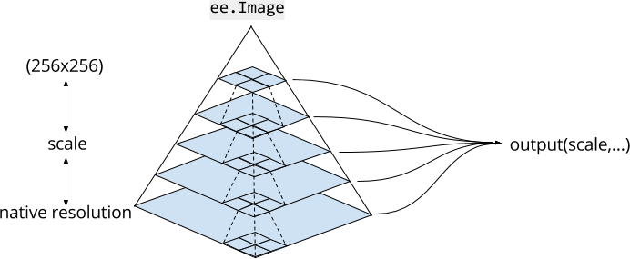

# Módulo 2: Gestión de almacenamiento

## Administrar Assets


## Agregar asset a un script

* Puede importar un asset a una secuencia de comandos al hacer clic en el icono de flecha adelante .

* El archivo se ubicará en la sección de Imports de Code Editor.


## Diálogo de  información del Asset


 1. Identificador del asset
 2. Editor de fecha de creación
 3. Botón de _Imports_ similar a .
 4. Administrar uso compartido del asset.
 5. Borrar el asset (**IMPORTANTE**, ho hay vuelta atrás!)

## Gestión de uso compartido


## Subir un raster en GTiff


 1. Seleccionar el archivo GTiff a subir desde nuestro sistema de archivos.
 2. Dar un *assetid*, ese identificador se compone de la ruta del asset del usuario más el nombre que le demos al archivo que subimos.
 3. Ajustar parámetros de metadatos, eso en el caso de que fuese necesario.
 4. Seleccionar un método de *Pyramid policy*
 5. Indicar cuál es el valor de no dato para que GEE lo enmascare.



## Subir una tabla (vector)


1. Seleccionar los archivos del shapefile, como mónimo deben estar: .shp, .dbf, .prj y. shx. *No incluir archivos que no sean del estandar ESRI Shapefile*.
 2. Dar un *assetid*, ese identificador se compone de la ruta del asset del usuario más el nombre que le demos al archivo que subimos.
 3. Indicar una configuración de caracteres en caso de usar una distinta a UTF-8.


## Exportar datos rasters desde el código

```Javascript
// Ejemplo 10
var root_asset = 'users/<usuario-gee>/curso-gee/';
var file_name = "recorte-l8-" + periodo_1.start_date + "_" + periodo_1.end_date

// Subir un raster al Asset
Export.image.toAsset({
  image: mosaico, 
  description: file_name,
  assetId: root_asset + file_name, 
  region: limite, 
  scale: 30, 
  maxPixels: 1e13});

// Subir un raster a Google Drive
Export.image.toDrive({
  image: mosaico, 
  description: file_name,
  folder: 'Curso-GEE', 
  region: limite, 
  scale: 30, 
  maxPixels: 1e13});
```


## Exportar datos vectoriales desde el código

```Javascript
// Ejemplo 10

```


